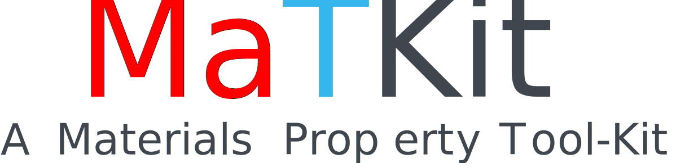

<p align="center">
  
</p>

**MaTKit** stands for **Ma**terials Property **T**ool **K**it. As the name implies, this workflow is designed to compute mechanical properties of crystalline materials primarily from density functional theory (DFT) calculations and also Molecular Dynamics (MD). It is intended to serve the needs of mechanicians and materials scientists.

## Keep it Simple

While many sophisticated and reliable materials property workflows exist in the open-source community, they often come with a steep learning curve and complex setup requirements. While these workflows are excellent for high-throughput computations, their complexity can be overwhelming for some researchers. MaTKit is designed to be straightforward and minimalistic, avoiding the complexity of those advanced workflows. The goal is not to *reinvent the wheel*. While MaTKit can handle moderately high-throughput calculations albeit lacking database management, robustness and error-handling capabilities, it is primarily intended for ease of use and simplicity, aimed towards a small and focussed set of calculations by material scientists looking to *simply get the job done*. MaTKit also aims to offer workflows for determining a select set of material properties that are not typically covered by existing materials property workflows.

## Supported property calculations

The following property workflows are currently available within MaTKit:

* **Theoretical strength**: Calculates the theoretical strength under superimposed complex stress states. While calculations of fcc, cubic diamond, bcc and hcp crystal structures are currently supported, the code is very general and users can extend the calculations to any crystal symmetry given the crystal structure and the directions to deform the crystal.

    To get started on theoretical strength, read the documentation [theoretical_strength.md](docs/theoretical_strength.md).

* **Constrained optimization**: Optimizes a super-cell (cell shape, size and internal degrres of freedom) to a prescribed stress state (controlling all six components of the Cauchy stress tensor and mixed boundary conditions where either stresses or fixed displacement conditions can be prescribed, as opposed to only being able to prescribe the target pressure).

    To get started on constrained optimization, read the documentation [constrained_optimization.md](docs/constrained_optimization.md).

## Future plans
In the very near future, the following workflows will be made available within the MaTKit framework:

* **Second and higher order elastic constants**: Calculates the 2<sup>nd</sup>, 3<sup>rd</sup>, 4<sup>th</sup> and 5<sup>th</sup> order elastic constants of crystals of arbitrary symmetry using DFT at 0K. Higher order elastic constants are particularly useful in modelling stress induced phase transformations in materials (for example see: [Pattamatta et al., *Allotropy in ultra high strength materials*](https://doi.org/10.1038/s41467-022-30845-z) ).
* **Surface energies**: Calculates the high symmetry surface energies of cubic and hexagonal lattices.
* **Stacking fault energies, generalized stacking fault energy curves and gamma surfaces**: Calculates the stacking fault energies and gamma surfaces of cubic and hexagonal crystals.
* **Equation of state, cohesive and formation energies**: Calculates the equation of state, cohesive energies and formation energies of alloys.

## Supported calculators
The code currently supports the following calculators:

* [VASP](https://www.vasp.at/)

In the near future, we plan to support [Quantum ESPRESSO](https://www.quantum-espresso.org/) and [LAMMPS](https://www.lammps.org).

## Prerequisites
The following python packages are required to run MaTKit. All these packages can be installed using the following command with in a ``conda`` environment as follows:

```sh
pip install ase pymatgen phonopy scikit-learn
```

While packages like ``spglib`` are used by MaTKit, they are indirectly installed as dependencies of the aforementioned packages.

## Configuration
MaTKit does not need any installation, except for a minimal configuration to let the package know about the machine on which it is running, as explained below:

1. Download the code and set the `PYTHONPATH` environment variable in the  `~.bashrc` file as follows:

    ```sh
    export PYTHONPATH="<path-to-downloaded-matkit-directory>:$PYTHONPATH"
    ```
    
2. Setup machine configuration with details of your machine (Laptop/Desktop/HPC Cluster) as follows:

     (i). Add environment variable ``MACHINE_NAME`` to your ``~.bashrc`` file as follows:

     ```sh
     export MACHINE_NAME="<your-chosen-machine-name>"
     ```
      
     Example: `export MACHINE_NAME="subbuhku"` where `subbuhku` is the name I chose for my computer.
      
     (ii). Create a machine configuration file to provide some details about your machine. Copy the file `subbuhku.py` in the ``machine_config`` directory to `<your-machine-name>.py` within the same directory and modify the fields accordingly.
   
     MaTKit reads the environment variable ``MACHINE_NAME`` and uses the appropriate machine configuration file ``<your-machine-name>.py``.

3. Configure Atomic Simulation Environment (ase) to be able to generate (copt to desired location or concatenate in case of alloys) POTCAR files for VASP.
   
    ```sh
    export VASP_PP_PATH='<path-to-vasp-pseudopotentials>'
    ```

     The VASP pseudo-potentials ``<path-to-vasp-pseudopotentials>`` directory shall contain subdirectories ``potpaw_LDA`` and ``potpaw_PBE`` as shipped by VASP.

## Job management
We provide a light-weight manager-worker based *taskfarmer* called the **pytaskfarmer** as a part of this package, to run a large number of jobs (the jobs can be of different granularity), under a single (or multiple) SLURM job submission environment. All workflows in MaTKit use the pytaskfarmer. Refer to [pytaskfarmer.md](docs/pytaskfarmer.md) for the usage of the taskfarmer. Note that this taskfarmer is generic and can be used for any other jobs not necessarily related to MaTKit or even materials science.

## License

MaTKit is released under the GPL Version 3.0 License. The details of the terms of license are provided in the LICENSE file.

```txt
This program is free software: you can redistribute it and/or modify it under the terms of the
GNU General Public License as published by the Free Software Foundation, either version 3 of the License,
or (at your option) any later version.

This program is distributed in the hope that it will be useful, but WITHOUT ANY WARRANTY; without even
the implied warranty of MERCHANTABILITY or FITNESS FOR A PARTICULAR PURPOSE.  See the GNU General Public
License for more details.

You should have received a copy of the GNU General Public License along with this program.  If not, see
<https://www.gnu.org/licenses/>.
```

## Reporting bugs

Please report any bugs and issues please submit a [GitHub issue].

[github issue]: https://github.com/spattamatta/matkit_unpublished/issues

## Citing MaTKit
If you use any of the workflows in MaTKit, please consider citing the appropriate journal article as follows:

**Theoretical strength**

> A. S. L. Subrahmanyam Pattamatta and David Srolovitz. *The theoretical strength of crystals*. (Under Review in Materials Research Letters, 2024).

## About the developer

MaTKit is developed by **A. S. L. Subrahmanyam Pattamatta**. He is currently a Research Assistant Professor in the Department of Mechanical Engineering at The University of Hong Kong and is associated with the *Materials Theory and Computation Group* headed by Professor [**David J. Srolovitz**](https://www.mech.hku.hk/academic-staff/srolovitz-david). He obtained his PhD from the Department of Aerospace Engineering and Mechanics at the University of Minnesota. His research interests lie at the intersection of mechanics and materials, primarily material stability, phase transformations, numerical continuation and bifurcation analysis, continuum and statistical mechanics, and alloy design using AI. He is open to collaborations with other researchers and can be reached at [lalithasubrahmanyam@gmail.com](mailto:lalithasubrahmanyam@gmail.com).
